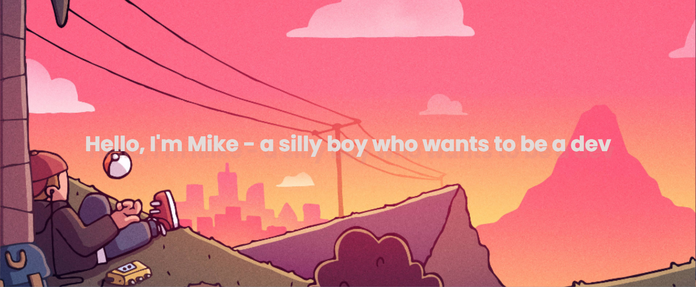

</a>

<!--
**mhiuuu/mhiuuu** is a ✨ _special_ ✨ repository because its `README.md` (this file) appears on your GitHub profile.
Here are some ideas to get you started:
- 🔭 I’m currently working on ...
- 🌱 I’m currently learning ...
- 👯 I’m looking to collaborate on ...
- 🤔 I’m looking for help with ...
- 💬 Ask me about ...
- 📫 How to reach me: ...
- 😄 Pronouns: ...
- ⚡ Fun fact: ...
-->
<h1 align="center">Hi there 👋 I'm Mathew</h1>
<h4 align="center">FULL STACK WEB DEVELOPER | COMPETITIVE PROGRAMMER</h4>

 

  <a>  Python</a>
  <a>  Javascript</a>
  <a>  HTML5</a>
  <a>  CSS3</a>
  <a>  Bootstrap5</a>

 

<h1 align="center">About Meee</h1>

 

  🏫: I'm a 15 years old developer from Viet Nam.

  🔭: I’m currently learning competitive programming.
  
  👯 I’m looking to collaborate on learn how to print "Hello world"
  
  🌱: I’m currently learning data structures and algorithms. 🖥

  🤡: My dream is to be a software engineer at Googleeee

  🤔: I’m also a content creator for some volunteer projects! 💪

  💬: Ask me anything about web development or internship =)

  ⚡  Fun fact: Despite of being a developer and a content creator, I make spelling mistake. 🙃

 

<h1 align="center">My Github Statistics</h1>

  
    
    

 

<h1 align="center">Connect with me:</h1>

  
  
  
  

